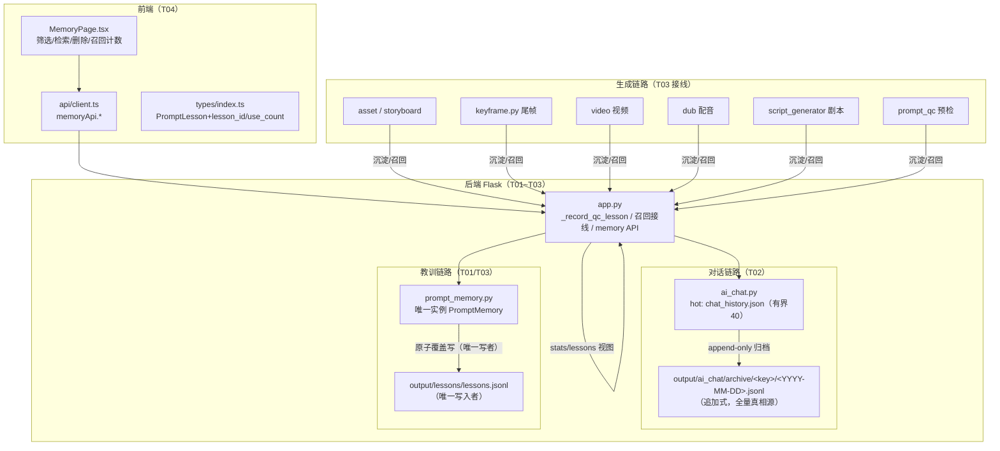
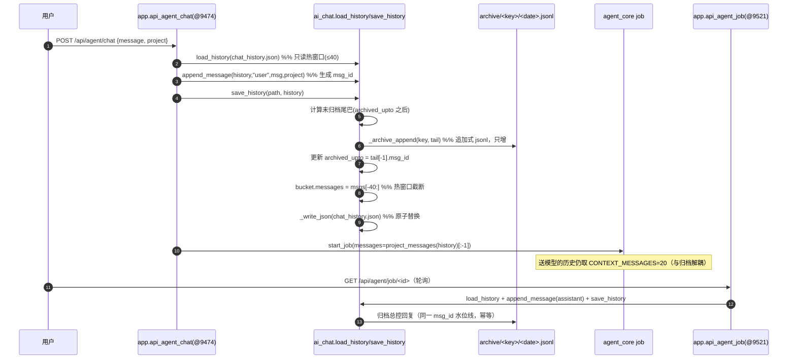
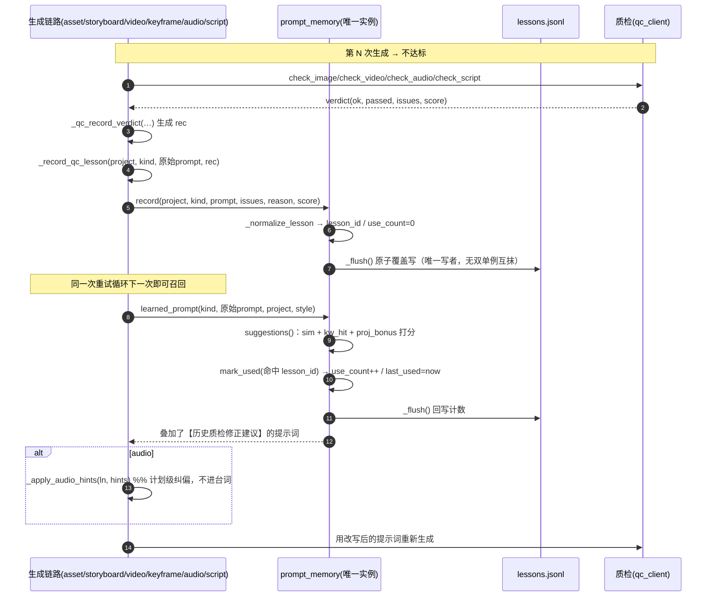
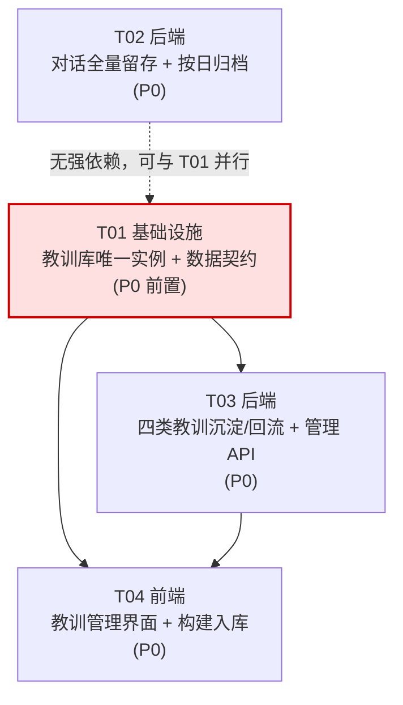

# 增量系统设计｜记忆闭环（memory_loop）

> 本文为**增量设计**，只描述本次变更涉及的模块，不重写全量架构。
> 对照 PRD：`docs/software-company/memory-loop-prd.md`（14 条 P0）
> 作者：高见远（架构）｜ 落盘：`docs/software-company/memory-loop-design.md`
> 所有行号/符号均来自源码实读；凡属推断均显式标注「（推断，待工程师核实）」。

---

## 0. 本次范围与产出对应关系

| PRD 变更 | 本设计章节 | 任务 |
| --- | --- | --- |
| 变更 2 · REQ-2.6 统一写入实例（P0 前置） | §2.1 | **T01** |
| 变更 1 · REQ-1.1~1.4、1.6（全量留存 / 按日期归档 / 存档与上下文解耦） | §2.2 | **T02** |
| 变更 2 · REQ-2.1~2.5、2.7（四类教训沉淀 + 回流 + video 空洞定位） | §2.3 | **T03** |
| 变更 3 · REQ-3.1~3.4（筛选 / 检索 / 删除 / 召回计数） | §2.4 | **T03 + T04** |
| P1：REQ-1.5 摘要、REQ-3.5 详情、REQ-3.6 分页 | 部分纳入 / 明确标注 | T02 / T04 |
| P2：REQ-1.7 存档浏览导出 | 后端 API 提供，前端**本期不做** | 附录 A |

---

## Part A：系统设计（增量）

### 1. 实现方案总览

#### 1.1 核心技术难点与决策

| # | 难点 | 决策 |
| --- | --- | --- |
| D1 | **教训库双单例同文件覆盖写**（`prompt_memory.py`：`_INSTANCE`@388 与 `_ENHANCED_INSTANCE`@727 各持一份内存列表，`_flush()`@159 用 `open(path,"w")` 整文件覆盖 → last-writer-wins）。`script_generator.py:181` 走增强单例，被 base 单例的下一次 flush 整体抹掉，**这是 `script=0` 的直接解释**（base 侧 asset/storyboard 每次必 flush，覆盖了增强侧刚写的 script 行） | **收敛为唯一实现 `PromptMemory`**：把增强字段/方法**折进** `PromptMemory`，删除 `_ENHANCED_INSTANCE`，`get_enhanced_memory` 返回与 `get_memory` **同一对象**。`_flush()` 改为「唯一临时名 + fsync + `os.replace` 退避重试」的原子写。详见 §2.1 |
| D2 | 「全量留存」与「送模型有界」是**两个需求**，`HISTORY_MAX_MESSAGES` 同时管存档与送模型 | **存档与上下文解耦**：`chat_history.json` 降级为**有界热窗口**（仍 40 条），全量真相源 = 追加式 `output/ai_chat/archive/<key>/<YYYY-MM-DD>.jsonl`。`HISTORY_MAX_MESSAGES` **不调大**，语义收窄为「热窗口上限」。详见 §2.2 |
| D3 | 教训无稳定主键 → 删不掉、召回计数回写不了；存量 71 条无 `use_count` | `lesson_id` **确定性派生**（`sha1(kind␟phash␟ts)`），**存量行零迁移即可删**；`use_count` 默认 **0**（不按 ts 估算，避免伪造「被用过」）。详见 §2.1 / §3 |
| D4 | 四类新教训的**召回点**语义不同：图片类可把建议追加进提示词；**音频类不能**（追加进 `text` 会被 TTS 念出来） | **分类处理**：`keyframe/script/prompt` 走「追加进构造提示词」；**`audio` 走「计划级纠偏」**（hint 映射为 plan 修复，原文只挂 `line["audio_hints"]` 供审计，绝不拼进台词）。详见 §2.3 |
| D5 | `video` 有调用代码却 0 条落盘 | 见 §2.3.5「定位结论 + 排查任务」；结论是**运行时前置条件未满足**，非代码路径缺失 |
| D6 | 前端构建产物必须入库；IDE 主题为 light | 构建 `cd frontend && npx tsc --noEmit && npx vite build` → `app/static/`，产物随 T04 一并提交；新增 UI 一律浅色底深色字 |

**架构模式**：沿用现有「模块化单体 Flask + 本地文件」形态，不引入分层框架。变更全部落在既有模块的**函数级接线**上：
- 写入侧：新增/补齐 `_record_qc_lesson(...)` 调用点（复用既有唯一入口@5024，不在各处自建写入）。
- 召回侧：复用 `prompt_memory.suggest / learned_prompt`（模块级函数，向后兼容不变）。
- 存储侧：复用 `ai_chat._atomic_replace` / `_write_json` 的唯一临时名 + fsync + 退避重试范式（不另造）。

#### 1.2 框架 / 库选择

**本次零新增依赖**。全部复用既有：Flask（`app/app.py`）、`threading`（并发）、`hashlib`/`json`（落盘）、React + TS + MUI + Tailwind（`frontend/`）。新增存储仅用标准库文件 I/O。见 §6 确认。

#### 1.3 增量架构图



---

### 2. 模块设计

#### 2.1 T01｜教训库统一为唯一实例 + 数据契约（P0 前置）

##### 2.1.1 拍板点 1：以哪个类为唯一实现？

**决策：以 `PromptMemory`（`prompt_memory.py:131`）为唯一实现，增强能力折入其中；`PromptMemoryEnhanced` 退化为空壳别名。**

- 把 `record_with_context`（@524）、`suggestions_with_priority`（@577）、`decay_old_lessons`（@647）、`get_learning_curve`（@665）、`list_with_context`（@705）**整体搬进 `PromptMemory`**。
- `PromptMemoryEnhanced(PromptMemory)` **保留类名**（`isinstance` 不破），但**不再定义 `__init__`、不再有独立 `_path`**；`_ENHANCED_INSTANCE`（@723）与 `_ENHANCED_INST_LOCK`（@724）**删除**；`get_enhanced_memory(root_dir)`（@727）改为 `return get_memory(root_dir)`。
- 效果：全模块**恰好一个** `_path`、**恰一个**内存列表、**恰一个**写入者。

##### 2.1.2 拍板点 2：增强版独有字段保留还是裁剪？

**决策：全部保留为「可选字段」，不裁剪、不新增行为。**

理由：PRD §4 Non-Goals 明确「不做教训自动权重学习」，但**保留字段**零成本且避免破坏既有数据语义（`category/priority/context/decay_weight` 已在 `record_with_context` 产出并被 `suggestions_with_priority`/`get_learning_curve` 消费）。写入侧统一后：
- `record(...)`（基础路径）：`category` 由 `categorize_issue`（@458）自动推断，`priority` 由 `assess_priority`（@470）推断，`context={}`，`decay_weight=1.0` —— 与 `record_with_context` 产出**同形**。
- `record_with_context(...)`：保留调用方显式传入的 `category/priority/context`。
- 读取侧（`suggestions`@220）**不依赖**这些字段存在，故存量 71 条无字段记录不受影响。

##### 2.1.3 拍板点 3：向后兼容的函数契约（全部保持）

| 模块级函数（现签名不动） | 统一后实现 |
| --- | --- |
| `get_memory(root_dir)` @388 | 返回唯一 `PromptMemory` 实例 |
| `record(project, kind, prompt, issues, reason, score, root_dir)` @396 | → 唯一实例 `.record(...)` |
| `suggest(kind, prompt, project, root_dir, style)` @404 | → 唯一实例 `.suggestions(...)` |
| `learned_prompt(kind, prompt, project, root_dir, max_hints, style)` @411 | → 唯一实例 `.learned_prompt(...)` |
| `get_enhanced_memory(root_dir)` @727 | → **同一** `get_memory(root_dir)` 实例 |
| `record_with_context(..., root_dir)` @735 | → 唯一实例 `.record_with_context(...)` |
| `suggest_with_priority(..., root_dir)` @747 | → 唯一实例 `.suggestions_with_priority(...)` |
| `get_learning_curve(project, root_dir)` @757 | → 唯一实例 `.get_learning_curve(...)` |
| `decay_lessons(root_dir)` @764 | → 唯一实例 `.decay_old_lessons(...)` |

`script_generator.py:181`（`record_with_context`）与 `app/app.py`（`record`/`suggest`/`learned_prompt`）**无需改调用点**。

##### 2.1.4 拍板点 4：存量 71 条的兼容策略

- **主键**：`lesson_id = "L" + sha1(f"{kind}\x1f{phash}\x1f{ts}".encode("utf-8")).hexdigest()[:16]`
  - **确定性派生** → 存量 71 条**无需迁移文件**即可被删除/回写；新记录写入时同规则生成并**显式落盘**该字段。
  - 唯一性：同 `kind+phash` 的旧记录本就被 `record()` 的合并逻辑（@193-194）保留为最新一条，故 `ts` 维度足以区分；秒级 `ts` 冲突仅在「同秒同 phash 同 kind」出现，而该情形会被去重合并，不产生两行。
- **`use_count` 回填**：**一律默认 0**，`last_used` 默认 `null`。不按 `ts` 估算——PRD US-11 的价值正是「识别从未被召回的**死教训**」，估算会伪造计数、摧毁该判据。
- **加载即补**：`_load()`（@141）逐行读入后调用 `_normalize_lesson(d)` 补齐 `lesson_id/use_count/last_used`；`_flush()` 时自然落盘回去（惰性迁移，无一次性脚本、无停机）。

##### 2.1.5 落盘强化（原子写）

`_flush()`（@159）当前为「裸 `open(w)`」。统一为：
1. 唯一临时名：`f"{path}.{pid}.{tid}.{urandom(3).hex()}.tmp"`（与 `ai_chat._write_json`@129 同型，避免并发写者互相截断）。
2. `flush()` + `os.fsync(fileno())`。
3. `os.replace(tmp, path)`，遇 `PermissionError`（Windows 占用）退避重试（复用 `ai_chat._atomic_replace`@107 的重试范式；可在 `prompt_memory.py` 内本地实现同型实现，避免跨模块硬依赖）。
4. 全程在 `self._lock`（RLock）内。

##### 2.1.6 新增方法（供 T03/T04 使用）

```
lesson_id(kind, phash, ts) -> str            # 静态派生
mark_used(lesson_ids: list[str]) -> int      # 命中回写 use_count++ / last_used=now
delete(lesson_id: str) -> bool               # 单条删除
delete_by_kind(kind: str) -> int             # 复用现有 clear(kind)@354
query(kind="", kinds=None, project="", since="", until="", q="", limit=50, offset=0) -> dict
                                             # 多维筛选 + 关键词检索，返回 {items, total, filtered}
dead_count() -> int                          # use_count==0 的条数
```

`query` 的关键词匹配口径：`q` 命中 `issues ∪ terms ∪ reason ∪ prompt` **任一**即命中（PRD §5 检索框约定）。

---

#### 2.2 T02｜总控聊天记录全量留存 + 按日期归档

##### 2.2.1 拍板 Q1：唯一真相源

**决策：归档 jsonl = 全量真相源；`chat_history.json` = 有界热窗口（读路径有界）。**

| 层 | 文件 | 语义 | 读路径 |
| --- | --- | --- | --- |
| 热 | `output/ai_chat/chat_history.json` | 每项目桶保留最近 `HISTORY_MAX_MESSAGES`(=40) 条 | `load_history`@189（有界） |
| 冷 | `output/ai_chat/archive/<canonical_key>/<YYYY-MM-DD>.jsonl` | **只增不减**，全量 | `load_archive` / `load_all_messages`（按需懒加载） |

- **`HISTORY_MAX_MESSAGES` 不调大**（硬约束 C1）；其语义由「上限（超出丢弃）」收窄为「**热窗口上限**」，注释同步改写。
- **`CONTEXT_MESSAGES`(=20) 与存档完全独立**：`build_messages`@538 仍只取 `project_messages(...)[-CONTEXT_MESSAGES:]`，**不改一行**。→ REQ-1.3 天然成立（存档 1000 条时送模型仍 ≤ 20 条）。
- **读路径有界**（REQ-1.6）：`load_history` 只读热文件，耗时/内存不随归档总量增长。

##### 2.2.2 消息唯一标识与归档一致性（REQ-1.4）

- `append_message`@232 生成 `msg_id`：`f"m_{time.strftime('%Y%m%dT%H%M%S')}_{urandom(3).hex()}"`，与 `time` 一并写入消息对象。
- 归档行复用**同一** `msg_id` → 热/冷两处的标识一致。

##### 2.2.3 归档写入路径（幂等、不重复）

在**已加锁**的 `save_history`@222 内，**在按窗口截断之前**追加未归档尾巴：

```
save_history(path, history):
    with _CHAT_LOCK:
        for key, bucket in history["projects"].items():
            msgs = _clean_messages(bucket.get("messages"))
            upto = bucket.get("archived_upto") or ""      # 水位线（msg_id）
            start = 0
            if upto:
                for i, m in enumerate(msgs):
                    if m.get("msg_id") == upto:
                        start = i + 1
                        break
                else:
                    start = 0        # 水位线丢失（回滚/换机）→ 保守全量补写（见下）
            tail = msgs[start:]
            if tail:
                _archive_append(key, tail)                 # 追加式 jsonl（每日文件）
                bucket["archived_upto"] = tail[-1]["msg_id"]
            bucket["messages"] = msgs[-HISTORY_MAX_MESSAGES:]   # 热窗口截断
        history["updated_at"] = _now()
        _write_json(path, history)
```

`_archive_append(key, msgs)`：按 `m["time"][:10]` 分组 → 以**追加模式** `open(..., "a", encoding="utf-8")` 逐行写 `json.dumps(rec, ensure_ascii=False)`；`makedirs(dirname, exist_ok=True)`。

- **幂等性**：水位线保证同一条消息只归档一次；正常路径无重复。
- **已知边界（可接受，需在代码注释标注）**：`drop_last_message`@242 回滚最后一条消息时，若该条**已被先前一次 save 归档**，归档里会**保留**该条（append-only 无法撤回）。这是「留痕」而非「脏数据」——它确实被用户发过。**热窗口不再含它**，故上下文不受影响。
- **不新增 `@_locked` 函数**：`_archive_append` 为普通私有函数（在 `_CHAT_LOCK` 内被调用），**保持 `ai_chat.py` 中 `@_locked` 数量恒为 3**（`verify_atomic_write_locks.py:283` 断言 `count("@_locked\n") == 3`）。⚠️ 这是硬性测试约束，务必遵守。

##### 2.2.4 读/导出路径（懒加载）

```
archive_dates(root, key) -> [{"date","count"}]     # 列目录 + 逐文件计数（只读文件名/行数）
load_archive(root, key, date, limit=0, offset=0) -> [msg]
load_all_messages(history, project) -> [msg]       # 热窗口 + 全部归档按时间合并（验收/导出用）
```

- `load_all_messages` 是 **REQ-1.1「读回仍为 100 条」的验证入口**：热(40) + 归档(60) 合并去重（按 `msg_id`）→ 100 条。**见 §8 待明确事项 Q-arch-1**。
- 文件命名 `output/ai_chat/archive/<canonical_project_key>/<YYYY-MM-DD>.jsonl`（`canonical_project_key`@281，与 PRD §变更1 一致；key 已由 `canonical_project_key` 保证文件系统安全，无需再 `safe_key`）。
- **REQ-1.5（早期滚动摘要，P1）**：**本期不做**，标注为下一迭代；`build_messages` 保持纯最近 N 条（降级路径天然满足「失败不阻断」）。见 §8 Q-arch-2。

---

#### 2.3 T03｜四类质检教训的沉淀与回流（+ video 空洞定位）

统一口径：**沉淀**一律走 `_record_qc_lesson(project_name, kind, prompt, rec)`@5024；**召回**一律走模块级 `prompt_memory.suggest / learned_prompt`。`prompt` 参数必须是**原始提示词**（不含已叠加的建议块），保证 `phash` 稳定（沿用 `orig_asset_prompt`@2280 / `orig_prompt` / `orig_video_prompt`@3504 既有范式）。

##### 2.3.1 `keyframe`（尾帧）

| 项 | 位置 | 改动 |
| --- | --- | --- |
| 沉淀 | `app.py:_keyframe_qc_verifier._verify`（@5208-5216） | 当前只算出 `gate` 并返回 `(ok, reason)`，**不落教训**。补：`if not gate.get("accept")` → `rec = _qc_record_verdict(project_name,"keyframe",shot_key,"尾帧质检",n,seed,path,verdict,style=...)` + `_record_qc_lesson(project_name,"keyframe", <原始尾帧提示词>, rec)`。`shot_key` 取 `f"shot_{item.get('seq')}"`。 |
| 稳定提示词键 | `keyframe.build_end_frame_prompt(shot, chained=item.get("chained"))`（@98） | 该函数**确定性**，可重算得同一串，作为教训 `prompt`（不依赖 preflight 自愈后的串）。 |
| 召回 | `keyframe.generate_keyframes`（@311） | **新增可选参数** `recall_cb: Optional[Callable[[str, dict, dict], str]] = None`（与 `verify_cb`@316 / `preflight_cb`@318 同注入风格，保持 `keyframe.py` 零依赖）。在 @388 `prompt = build_end_frame_prompt(...)` 之后、`attempt` 循环内，`attempt>0` 时 `prompt = recall_cb(orig_prompt, shot, item) or orig_prompt`。 |
| 注入 | `app.py:1431`（`generate_keyframes(...)` 调用） | 新增 `recall_cb=_kf_recall`；`_kf_recall` 由新函数 `_keyframe_recall_cb(project)` 构造，内部 `prompt_memory.learned_prompt(kind="keyframe", prompt=orig, project=project, root_dir=PROJECT_OUTPUT_DIR, style=_qc_style_of(project))`。 |

> 现状缺口：`generate_keyframes` 的重试**只换 seed、从不改写提示词**（@422-439），故尾帧教训若无 `recall_cb` 则「记了也用不上」。`recall_cb` 是闭环的必要条件。

##### 2.3.2 `audio`（配音）

**沉淀点**：`_audio_qc_lines`（@7134）逐句质检处。当 `not verdict.get("passed")` 时：
```
_record_qc_lesson(project_name, "audio", <该句 TTS 输入文本 ln["text"] 的原文>, rec)
rec = {"issues": verdict.issues + critical_issues, "reason": verdict.reason, "score": verdict.score, "audio": True}
```
> 用 `ln.get("text")`（清洗后的台词）作 prompt 键：它正是 TTS 的实际输入，`phash` 稳定。**注意**：若在 preflight 中已自愈过 `ln["text"]`，取**自愈前**的原文作键（在 `_dub_prompt_preflight` 前保存 `orig_text`）。

**召回点（关键设计，勿踩坑）**：配音召回**不能**把建议追加进 `ln["text"]`（会被 TTS 念出来）。改为**计划级纠偏**：
- 在 dub 计划构建后（`app.py:7478` 与 `7629` 两处 `build_dub_plan(...)` 之后、逐句合成之前）：
  ```
  hints = prompt_memory.suggest(kind="audio", prompt=ln["text"], project=project_name, root_dir=PROJECT_OUTPUT_DIR)
  ln["audio_hints"] = hints            # 只存审计，不进台词
  _apply_audio_hints(ln, hints)        # 确定性纠偏
  ```
- `_apply_audio_hints(ln, hints)`（**新增于 `app.py`**，纯函数、可单测、无副作用外溢）：
  | hint 特征 | 纠偏动作 |
  | --- | --- |
  | 含「旁白」/「speaker」 | 若 `ln["character"] == tts_client.NARRATION_SPEAKER` 且剧本有 `dialogue[].speaker` → 回填该 speaker，避免角色台词被旁白念 |
  | 含「情绪」/「instruct」 | `voice.mode=="preset"` 时切 `design`，确保 `instruct` 携带 `emotion` |
  | 含「时长」/「截断」 | 记录 `ln["audio_expect_sec"]` 供质检比对（不阻断） |
  | 其它 | 仅记录，不改 plan |
- **不改 `tts_client.py`**（缩小爆炸半径）：`build_dub_plan` 保持纯计划构建，召回/纠偏全在 `app.py` 侧。

##### 2.3.3 `script`（剧本）

| 项 | 位置 | 改动 |
| --- | --- | --- |
| 沉淀 | `script_generator.py:181`（`record_with_context`） | **已存在**；T01 统一后即会真正落盘（消除 `script=0`）。 |
| 召回 | `script_generator.generate_script_with_qc`（@71 重试循环） | 每次重试前召回 `kind="script"`：`hints = prompt_memory.learned_prompt(kind="script", prompt=<上一版剧本 JSON 摘要>, project=project_name, root_dir=PROJECT_OUTPUT_DIR)`，作为「历史质检教训」拼进生成提示词。 |
| 提示词注入 | `generate_script` @42 / `_generate_with_claude` @259 | 新增可选参数 `lessons_hint: str = ""`，拼接在 `prompt`（@263）末尾；默认空串 → **行为零变更**。 |
| 召回点扩展 | `novel_to_script` | **P1**（PRD 提及）；本期仅在 `script_generator` 落地，`novel_to_script` 标注为待办。 |

##### 2.3.4 `prompt`（提示词预检）

- **沉淀点**：预检不通过处。现有唯一 `_qc_record(project_name,"prompt",...)` 在 `_keyframe_prompt_preflight._pre`（@5254）。补齐：
  - `_keyframe_prompt_preflight._pre`（@5246）：在 `_qc_record` 旁补 `_record_qc_lesson(project_name, "prompt", <自愈前 prompt>, rec_from_pf)`（`rec` 由 `{"issues": pf.verdict.issues, "critical_issues": pf.verdict.critical_issues, "reason": pf.reason, "score": pf.verdict.score}` 构造）。
  - 资产预检（@2285 `_prompt_preflight("asset", ...)`）与分镜预检（@2820 `_prompt_preflight("storyboard", ...)`）：当 `not gate["accept"]` 或 `verdict.issues` 非空时同样沉淀 `kind="prompt"`。
  - **建议抽象一个小助手** `_record_preflight_lesson(project_name, prompt_original, pf, gate)` 收敛三处，避免复制粘贴。
- **召回点**：各预检**构造处**（`_prompt_preflight`@4854 的调用点）：在调用 `prompt_qc.preflight(...)` **之前**，对原始提示词召回 `kind="prompt"` 的建议并叠加：
  ```
  prompt0 = <原始提示词>
  prompt1 = prompt_memory.learned_prompt(kind="prompt", prompt=prompt0, project=project_name, root_dir=PROJECT_OUTPUT_DIR, style=<style>)
  prompt_qc.preflight(kind, prompt1, ...)
  ```
  > 预检本身是**确定性**检查（`prompt_qc` 零模型依赖），召回的价值在于把「历史上被预检判死的输入模式」变成显式补丁后再进预检，从而**在生成前拦住废图输入**（US-7）。

##### 2.3.5 `video` 零落盘 —— 定位结论与排查任务（Q5）

**定位结论（高置信）**：**不是代码路径缺失，而是运行时前置条件未满足**。依据：

1. 两处调用都以 `qc_on = qc_client.video_qc_ready(qc_cfg)`（@3346）为前提：
   - @3378 在 `_seg_qc_fn` 内，而该回调仅当 @3399 `qc_fn=_seg_qc_fn if qc_on else None` 时注入；
   - @3606 在 per_shot 分支，位于 @3570 `if not qc_on: … break` **之后**。
   → `qc_on=False` 时两处**都不执行**。`video_qc_ready`（`qc_client.py:833`）= `cfg.enabled ∧ cfg.video_enabled ∧ endpoint_ready`。观测期内若视频生成时 `enabled=false` 或质检接口未配，则 0 条。
2. 两处还额外要求「**不达标且 `verdict.ok` 为真**」：@3372 `if not passed and verdict.get("ok")`、@3603 `if not verdict.get("ok"): break`。视频质检需 ffmpeg 抽帧 + 多模态，**调用异常/超时（`ok=false`）时静默跳过、不记教训**——失败率高于图片质检。
3. 路径可能根本没走到：per_shot 模式若已达标视频存在（@3464-3479）直接 `continue` 复用，压根不质检；整集模式一次通过则 `_seg_qc_fn` 不进入失败分支。
4. **排除双单例抹除**：若被抹除，`asset/storyboard` 同样归零；实存 `asset=3/storyboard=68`，证明 base 单例写入存活。`script=0` 反而**正是**增强单例被覆盖的证据（见 §2.3.3 / D1）。

**排查任务（并入 T03，限时定位）**：
- 在 @3378 与 @3606 前后各加一行显式日志，覆盖三种「未沉淀」原因：`qc_off` / `verdict.ok=false` / 复用跳过。示例：`app.logger.info("[教训][video] project=%s attempt=%d ok=%s passed=%s → %s", ...)`。
- 复用既有 `GET /api/qc/config` 返回的 `video_qc_active`（`qc_client.py:802`）作为开跑前自检。
- 验收：开启 `video_enabled` 并制造一次视频不达标，日志出现 `[教训][video] … → recorded`，且 `lessons.jsonl` 新增 `kind="video"` 行。

##### 2.3.6 kind 枚举与前端标签（REQ-2.7）

后端 kind 全集固定为：`asset | storyboard | video | keyframe | audio | script | prompt`（与 PRD §4 约束 4 一致）。
前端 `LESSON_KIND_LABEL`（`MemoryPage.tsx:9`）补齐并校正：新增 `audio:'配音'`、`script:'剧本'`、`prompt:'提示词预检'`；`keyframe` 由 `'关键帧'` 改为 **`'尾帧'`**（PRD §5 文案约定：界面不暴露原始 kind）。

---

#### 2.4 T03+T04｜教训管理（筛选 / 检索 / 删除 / 召回计数）

##### 2.4.1 召回计数（REQ-3.4）

- **计数口径**：在 `PromptMemory.suggestions`（@220）中，**当且仅当**某条教训的 `issues` 真正被渲染进返回的 `hints`（@266-278）时，把该条 `lesson_id` 记入本次命中的 `used_ids`；函数返回前调用 `mark_used(used_ids)`（`use_count += 1`、`last_used = _now()`）。
- **`learned_prompt`**（@318）内部调用 `suggestions` → 计数自动生效（`learned_prompt` 是生成链路实际入口）。
- **回写时机**：`mark_used` 内部置 `self._dirty=True` 并**立即原子 `_flush()`**（重试频率低，一次/若干轮，I/O 可忽略）。若后续观测到抖动，可加 `_MIN_FLUSH_INTERVAL`（≥1s）节流——**列为可选优化**。
- **`use_count` 语义解释**（前端 tooltip，PRD §5）：*「该教训被生成链路自动引用、用来改写提示词的次数。始终为 0 表示这条教训从未派上用场。」*

##### 2.4.2 后端接口（REQ-3.1/3.3）

| 方法 | 路径 | 变更 |
| --- | --- | --- |
| GET | `/api/memory/lessons`（@1164） | **扩展 query**：`kind`（支持逗号分隔多值）/`project`/`since`/`until`(ISO)/`q`(关键词)/`limit`/`offset`/`prune_empty`。返回 `{success,total,filtered,offset,limit,by_kind,dead_lessons,lessons[]}` |
| DELETE | `/api/memory/lessons/<lesson_id>` | **新增**：删单条（`prompt_memory.delete`）→ `{success,deleted,lesson_id}`；未命中 404 |
| POST | `/api/memory/lessons/clear` | **新增**：body `{kind}` → `prompt_memory.clear(kind)` → `{success,cleared,kind}` |
| GET | `/api/memory/stats`（@211） | **扩展**：`lessons` 节点补 `dead_lessons`、`by_kind`、`used_total` |
| GET | `/api/memory/lessons/search`（@186） | **语义不变**（按 prompt 召回试算）。关键词过滤**不复用它**（PRD §REQ-3.2 明确警告），走 `/api/memory/lessons?q=` |

**删除的不可逆警示**：前端 `ConfirmDialog`（`danger`）二次确认，文案「此操作不可撤销」（PRD §5）。后端不提供 undo。

##### 2.4.3 前端（T04）

- `types/index.ts`：`PromptLesson`（@162）补 `lesson_id?/use_count?/last_used?/category?/priority?/context?`；新增 `LessonQuery`、`LessonPage`。
- `api/client.ts`：`memoryApi.lessons(params)`（@294）扩参（`kind` 多值、`project/since/until/q/offset`）；新增 `memoryApi.deleteLesson(id)`、`memoryApi.clearLessons(kind)`、`memoryApi.lessonStats()`。
- `pages/MemoryPage.tsx`：「质检教训库」卡片升级：环节 chips **多选**（7 类）、项目下拉、时间区间、检索框（回车触发）、每条卡片显示 `被召回 N 次` 徽标（`N=0` 灰色弱化）、展开详情（`prompt/issues/terms/score/命中来源`）、删除按钮（ConfirmDialog）、「清空本环节」（显示将删数量）、「加载更多」。统计卡补「死教训数」。
- **浅色底深色字**（IDE 主题 light）：沿用现有 Tailwind 类（`bg-gray-50 text-gray-900` 等），**不新增暗色优先样式**。

---

### 3. 数据契约

#### 3.1 归档 jsonl 记录（每行一条）

```json
{
  "msg_id": "m_20260919T173012_ab12cd",
  "role": "user",
  "content": "画风改成国风水墨",
  "time": "2026-09-19T17:30:12",
  "date": "2026-09-19",
  "project": "蛊真人精校版",
  "project_key": "蛊真人精校版",
  "seq": 41
}
```
- `msg_id`：稳定唯一（热/冷一致，REQ-1.4）。
- `date`：冗余字段，便于 `grep`/按日切分/无需解析 `time`。
- `seq`：项目内全量序号（可选，便于导出排序）。

#### 3.2 热文件 `chat_history.json`（有界）

```json
{
  "version": 2,
  "messages": [],
  "projects": {
    "<canonical_key>": {
      "messages": [ { "role": "...", "content": "...", "time": "...", "msg_id": "..." } ],
      "archived_upto": "m_20260919T173012_ab12cd"
    }
  },
  "drafts": {},
  "active_project": "",
  "updated_at": "2026-09-19T17:30:12"
}
```
- 新增字段 `projects.<key>.archived_upto`、消息的 `msg_id`；**旧文件无这些字段 → 读入时容忍**（`load_history`@189 需在 `_clean_messages` 保留 `msg_id`；缺 `archived_upto` 视为空 → 首次 save 全量补写归档，见 §2.2.3 的「水位线丢失」分支）。

#### 3.3 教训 lesson 记录（新结构）

```json
{
  "lesson_id": "L3f9c2a1b8d4e6f0",
  "ts": "2026-09-19T18:20:51",
  "project": "蛊真人精校版",
  "kind": "keyframe",
  "phash": "9bee03ad204a",
  "prompt": "这是同一镜头「中景」的尾帧画面：…",
  "issues": ["景别不符：…"],
  "reason": "…",
  "score": 52,
  "terms": ["景别不符", "…"],
  "category": "visual",
  "priority": "medium",
  "context": {},
  "decay_weight": 1.0,
  "use_count": 0,
  "last_used": null
}
```
- **新增**：`lesson_id`（派生，见 §2.1.4）、`use_count`、`last_used`。
- **保留**：`category/priority/context/decay_weight`（可选，存量缺省；基础 `record` 路径自动推断）。
- **存量 71 条**（`asset=3 / storyboard=68`）仅缺 `lesson_id/use_count/last_used` → 加载即补（0 / null），删改即时可用。

#### 3.4 接口请求 / 响应字段

**`GET /api/memory/lessons`**
```
q: kind=asset,storyboard | project | since=2026-09-01 | until=2026-09-30 | q=发冠 | limit=50 | offset=0
→ { "success": true, "total": 71, "filtered": 12, "offset": 0, "limit": 50,
    "by_kind": {"asset":3,"storyboard":68}, "dead_lessons": 40,
    "lessons": [ {…lesson…} ] }
```

**`DELETE /api/memory/lessons/<lesson_id>`** → `{ "success": true, "deleted": 1, "lesson_id": "L…" }`（未命中 404 `{"success":false,"error":"未找到该教训"}`）

**`POST /api/memory/lessons/clear`** body `{"kind":"storyboard"}` → `{ "success": true, "cleared": 68, "kind": "storyboard" }`

**`GET /api/memory/stats`**（在现有 `stats` 上追加）
```
{ "success": true, "stats": { …, "prompt_lessons": 71 },
  "lessons": { "total": 71, "by_kind": {…}, "dead_lessons": 40, "used_total": 125 } }
```

**`GET /api/ai/chat/archive?project=<key>`** → `{ "success": true, "project": "<key>", "dates": [{"date":"2026-09-19","count":41}], "total": 41 }`

**`GET /api/ai/chat/archive/<date>?project=<key>&limit=&offset=`** → `{ "success": true, "date": "2026-09-19", "total": 41, "messages": [ {…archive msg…} ] }`

---

### 4. 文件清单（相对路径，标注新增/修改）

#### 后端

| 文件 | 操作 | 一句话说明 |
| --- | --- | --- |
| `app/prompt_memory.py` | 修改 | 收敛为唯一实例 `PromptMemory`（折入增强字段/方法，删 `_ENHANCED_INSTANCE`）；`lesson_id/use_count/last_used` + 惰性迁移；`_flush` 改原子写；新增 `mark_used/delete/delete_by_kind/query/dead_count`；模块级函数全部向后兼容 |
| `app/ai_chat.py` | 修改 | 消息加 `msg_id`；`save_history` 内追加归档（水位线 `archived_upto`）到 `output/ai_chat/archive/<key>/<YYYY-MM-DD>.jsonl`；新增 `_archive_append/archive_dates/load_archive/load_all_messages`；**`@_locked` 数量保持 3** |
| `app/app.py` | 修改 | 补 `keyframe/audio/script/prompt` 沉淀与召回接线；`video` 空洞加诊断日志；扩展 `/api/memory/lessons` 与 `/api/memory/stats`；新增 `DELETE /api/memory/lessons/<id>`、`POST /api/memory/lessons/clear`、`/api/ai/chat/archive*` |
| `app/keyframe.py` | 修改 | `generate_keyframes` 新增可选 `recall_cb`，在重试时用召回结果改写原始尾帧提示词 |
| `app/script_generator.py` | 修改 | 剧本质检失败重试时召回 `kind="script"` 并注入生成提示词（`lessons_hint` 可选参数） |
| `app/static/*` | 修改 | 前端构建产物（T04 生成，必须入库） |

#### 前端

| 文件 | 操作 | 一句话说明 |
| --- | --- | --- |
| `frontend/src/types/index.ts` | 修改 | `PromptLesson` 补 `lesson_id/use_count/last_used/category/priority/context`；新增 `LessonQuery/LessonPage` |
| `frontend/src/api/client.ts` | 修改 | `memoryApi.lessons` 扩参 + 新增 `deleteLesson/clearLessons/lessonStats` |
| `frontend/src/pages/MemoryPage.tsx` | 修改 | 教训卡片：多选 chips（含 audio/script/prompt）、项目/时间筛选、关键词检索、召回次数徽标、展开详情、删单条/清空、加载更多 |

#### 测试（离线套件，逐脚本独立调用）

| 文件 | 操作 | 一句话说明 |
| --- | --- | --- |
| `.workbuddy/test/verify_qc_memory.py` | 修改 | 断言单例唯一、`lesson_id/use_count`、新 kind 沉淀点、新接口；保留「真实 lessons.jsonl 未被污染」 |
| `.workbuddy/test/verify_qc_prompt_feedback.py` | 修改 | 同步 `_record_qc_lesson` 各 kind 计数；新增 audio/script/prompt/keyframe 接线断言 |
| `.workbuddy/test/verify_atomic_write_locks.py` | 修改 | 保持 `ai_chat` 的 `@_locked`==3 断言；补 `prompt_memory._flush` 原子写并发不损坏 |
| `.workbuddy/test/verify_ai_chat_archive.py` | **新增** | 归档全量留存、`archived_upto` 幂等、跨日切分、`load_all_messages` 合并不丢 |
| `.workbuddy/test/verify_memory_loop.py` | **新增** | 教训 CRUD/多维筛选/关键词检索/`use_count` 回写/删单条与清空；7 类 kind 全覆盖 |

---

### 5. 调用时序图

#### 5.1 总控对话落盘 + 归档（T02）



#### 5.2 质检失败 → 沉淀教训 → 下次召回（T01/T03）



---

### 6. 依赖包（预期零新增）

**确认：本次零新增第三方依赖。**
- 后端新增能力全部使用标准库：`hashlib`、`json`、`os`、`threading`、`time`、`datetime`、`re`（均已在 `prompt_memory.py` / `ai_chat.py` 导入）。
- 前端不新增 npm 包：筛选/检索/分页/MUI 组件（`ConfirmDialog`/`Badge`/`Card`）均已存在并被 `MemoryPage.tsx` 使用。
- **无数据库 / 无云服务 / 无向量库**（PRD 硬约束 3）。

---

### 7. 共享知识 / 跨文件约定（工程师必读）

1. **唯一写者**：`output/lessons/lessons.jsonl` 只能由 `prompt_memory` 的唯一实例写；**任何模块都不得直接 `open(...,"w")` 该文件**。写入一律走 `record/record_with_context`，读取走 `list/query`。
2. **原子写范式**：本地文件写盘一律「唯一临时名 + `flush` + `fsync` + `os.replace` + `PermissionError` 退避重试」（源范式：`ai_chat._atomic_replace`@107、`_write_json`@126）。新代码**复用**，不另造。
3. **`@_locked` 计数约束**：`app/ai_chat.py` 中带 `@_locked` 的函数**必须恰好 3 个**（`save_history`/`clear_history`/`save_project_settings`）。新增归档逻辑写在既有加锁函数内部或普通私有函数，**不得再加装饰器**（否则 `verify_atomic_write_locks.py:283` 红）。
4. **`HISTORY_MAX_MESSAGES`(=40) = 热窗口上限，不是「丢弃上限」**；**`CONTEXT_MESSAGES`(=20) 与存档完全无关**，不得因本次变更调整二者数值。
5. **教训 `prompt` 键必须用原始提示词**（不含已叠加的【历史质检修正建议】块），否则 `phash` 漂移、去重失效、召回错乱。既有范式：`orig_asset_prompt`@2280、`orig_prompt`、`orig_video_prompt`@3504。
6. **`{style}` 占位符**：教训的 issues 里涉及风格的文案必须保留 `{style}` 占位符，由召回时用**当前项目**风格替换（`_record_qc_lesson`@5033 已实现）。**不得在记录时写死项目风格**。
7. **kind 枚举单一事实源**：`asset|storyboard|video|keyframe|audio|script|prompt`。后端新增沉淀点、前端 `LESSON_KIND_LABEL`、测试断言三处必须一致。
8. **audio 召回绝不拼接进台词文本**（会被 TTS 念出来）；只做计划级纠偏 + `line["audio_hints"]` 审计留痕。
9. **落盘/构建**：改 `app/*.py` 后**必须重启 Flask 才生效**（重启会打断进程内的分镜/视频 worker，需择机——建议在无生产任务时重启）。前端 `cd frontend && npx tsc --noEmit && npx vite build`，产物落 `app/static/` 且**必须入库**。
10. **跑测试纪律**：`.workbuddy/test/` 共 **37** 个 `verify_*.py`。**逐个脚本独立调用**（宿主 CLI 单次调用累计删除 >50 文件会被判定为批量删除守卫而杀进程 → 假红）。推荐前缀 `MJSCXT_AUTOPILOT=0`。
11. **git 纪律**：**禁止 `git add -A`**（多会话并发，必须逐文件确认归属）；`.workbuddy/` 已 gitignore，勿删；临时目录用系统 temp，勿污染真实 `output/`。
12. **存量数据不可污染**：真实 `output/lessons/lessons.jsonl`（71 行）与 `output/ai_chat/chat_history.json` 不得被测试探针写入（测试一律用临时目录隔离）。
13. **浅色主题**：新增 UI 一律浅色底深色字。
14. **接口信封**：沿用 `{success, ...}` 形式（本项目**不是** `{code,data,message}`；以既有 API 为准）。

---

### 8. 待明确事项

| # | 事项 | 我的建议结论 | 需谁拍板 |
| --- | --- | --- | --- |
| **Q-arch-1** | REQ-1.1 验收「连续写入 100 条后**读回仍为 100 条**」与 REQ-1.6「`load_history` 只加载热窗口」字面冲突 | 以 C1/Q1 为准：`load_history` **保持有界（40）**；验收改用新增的 **`load_all_messages(project)`**（热 40 + 归档 60 = 100）。即「不丢」由归档保证，不是由 `load_history` 保证 | 主理人确认（影响验收用例写法） |
| **Q-arch-2** | REQ-1.5 早期滚动摘要（P1） | **本期不做**：摘要需额外一次模型调用（成本/失败面）+ 合并频率策略，收益低于 P0。`build_messages` 保持「纯最近 N 条」，降级路径天然满足。建议下一迭代立项 | 主理人 / PM |
| **Q-arch-3** | REQ-1.7 存档浏览/导出前端入口（P2） | **本期只提供后端 API**（`/api/ai/chat/archive*`），前端页面不做（不在已确认的三项范围内） | 主理人 |
| **Q-arch-4** | `novel_to_script` 的剧本召回（REQ-2.3 提及） | 本期仅落 `script_generator`；`novel_to_script` 标注 P1 待办 | PM |
| **Q-arch-5** | 「按 kind 清空」是否需输入 kind 名二次确认（PRD Q7） | 沿用 **ConfirmDialog(danger) + 显示将删除数量** 即可，不额外要求输入 kind（系统无用户体系，过度门槛伤体验） | PM |
| **Q-arch-6** | `video` 空洞定位（PRD Q5） | 已在 §2.3.5 给出高置信结论（运行时前置条件未满足）+ 显式日志排查任务；需**一次真实视频不达标运行**才能最终坐实 | 主理人安排验证 |
| **Q-arch-7** | `audio` 召回「计划级纠偏」的具体映射表是否够用（PRD Q6） | 已给最小可用映射（旁白/情绪/时长/其它）；若真实教训文案不落在这三类，需按实际 `issues` 扩展映射——**待工程师跑一次真实配音不达标后回填** | 工程师回填，架构复核 |

---

### 9. 测试影响清单

| 测试脚本 | 影响 | 需要的动作 |
| --- | --- | --- |
| `verify_qc_memory.py`（103 项） | **改单例结构即影响**：`pm.get_memory` 仍可用，但新增 `lesson_id/use_count`、新 kind、新接口需补断言；`_record_qc_lesson(project_name,"video")` 断言@319 保留 | 修改：补 `lesson_id` 派生、`use_count` 回写、`dead_lessons`、`keyframe/audio/script/prompt` 沉淀点、`DELETE/POST clear` 接口烟测 |
| `verify_qc_prompt_feedback.py` | `APP_SRC.count("_record_qc_lesson") >= 6`@163、各 kind 计数@170/173、`"learned = prompt_memory.learned_prompt("`@179 | 修改：同步计数（新增 keyframe/audio/script/prompt 接线）；若召回改为经新助手，需保留该字符串或更新断言 |
| `verify_atomic_write_locks.py`（68 项） | `ai_chat` 的 `@_locked`==3 断言@283；F 段 chat 并发落盘@226 | 修改：保持 `@_locked`==3；新增「归档追加并发不损坏」「`prompt_memory._flush` 原子写」用例 |
| `verify_ai_chat_archive.py` | **新增** | 全量留存、`archived_upto` 幂等、跨日切分、`load_all_messages` 合并不丢 |
| `verify_memory_loop.py` | **新增** | 教训 CRUD / 多维筛选 / 关键词检索 / `use_count` 回写 / 删单条 / 清空 / 7 类 kind |
| `verify_prompt_qc.py` | 若预检召回叠加改动 `_prompt_preflight` 入参 | 回归（预计不改签名则零影响） |
| `verify_script_audit.py` / `verify_audio_qc.py` / `verify_style_qc.py` / `verify_qc_ref_images.py` | 若 script/audio 链路新增召回调用 | 回归；建议在新增接线处加 `try/except` 兜底，保证「召回失败不影响生成」 |
| **其余 30 个 `verify_*.py`** | 预计零影响（不触碰 chat/lesson/prompt_memory 三处） | 全量回归仍须逐脚本独立跑 |

> ⚠️ 注意：团队约定提到的 `verify_ai_chat*` **当前仓库不存在**（仅 `verify_atomic_write_locks.py` 覆盖 chat 落盘）。故「归档」相关测试需**新建** `verify_ai_chat_archive.py`。

---

## Part B：任务分解

### 6. 依赖包

**零新增**（见 §6 确认）。无需在 `package.json` / `requirements.txt` 添加任何条目。

### 7. 任务列表（按实现顺序，标注依赖）

> 硬性约束：共 **4** 个任务（≤5）；每个任务 ≥3 个文件；按功能模块分组，不按单文件拆分；第一个任务为基础设施/前置。

---

#### **T01｜基础设施：教训库统一为唯一实例 + 数据契约（P0 前置）**

- **依赖**：无（根任务）
- **优先级**：**P0**
- **涉及文件**：
  - `app/prompt_memory.py`（修改）
  - `.workbuddy/test/verify_qc_memory.py`（修改）
  - `.workbuddy/test/verify_qc_prompt_feedback.py`（修改）
- **工作内容**：
  1. 把 `PromptMemoryEnhanced` 的 `record_with_context / suggestions_with_priority / decay_old_lessons / get_learning_curve / list_with_context` 折入 `PromptMemory`；删除 `_ENHANCED_INSTANCE/_ENHANCED_INST_LOCK`；`get_enhanced_memory` → `get_memory`（同一对象）。
  2. 新增 `lesson_id/use_count/last_used`，`_normalize_lesson` 惰性补齐存量；基础 `record` 自动推断 `category/priority`。
  3. `_flush()` 改「唯一临时名 + fsync + `os.replace` 退避重试」原子写。
  4. 新增 `mark_used/delete/delete_by_kind/query/dead_count`。
  5. 全部模块级函数签名与语义**向后兼容**（`script_generator.py:181` 与 `app.py` 调用点不改）。
- **验收标准**：
  - 全模块**恰一个** `_path` / 恰一个写入者；同一 `root_dir` 下 `get_memory() is get_enhanced_memory()` 为真。
  - 先 `record()` 写 3 条、再 `record_with_context()` 写 1 条 → `stats().total == 4`（互不覆盖）。
  - 存量 71 行读入后每行都有 `lesson_id`，且 `use_count == 0`。
  - `verify_qc_memory.py` / `verify_qc_prompt_feedback.py` 全绿；真实 `lessons.jsonl` 行数未被测试改变。

---

#### **T02｜后端：总控对话全量留存 + 按日期归档**

- **依赖**：无强依赖（可与 T01 并行；若需统一提交则排序在 T01 后）
- **优先级**：**P0**
- **涉及文件**：
  - `app/ai_chat.py`（修改）
  - `app/app.py`（修改：chat 归档只读 API）
  - `.workbuddy/test/verify_atomic_write_locks.py`（修改）
  - `.workbuddy/test/verify_ai_chat_archive.py`（新增）
- **工作内容**：
  1. `append_message` 生成 `msg_id`；`load_history` 保留 `msg_id`。
  2. `save_history` 内（**在加锁临界区、截断之前**）追加未归档尾巴到 `output/ai_chat/archive/<canonical_key>/<YYYY-MM-DD>.jsonl`，维护 `archived_upto` 水位线；再按 `HISTORY_MAX_MESSAGES` 截断热窗口并原子写。
  3. 新增 `_archive_append/archive_dates/load_archive/load_all_messages`（`_archive_append` **不加** `@_locked`）。
  4. `app.py` 新增 `GET /api/ai/chat/archive`、`GET /api/ai/chat/archive/<date>`。
  5. 注释改写 `HISTORY_MAX_MESSAGES` 语义为「热窗口上限」。
- **验收标准**：
  - 同项目连写 100 条 → `load_history` 30~40 条（有界）；`load_all_messages` **100 条**（不丢）。
  - 跨 3 天写入 → 归档目录出现 3 个日期文件，每行含 `role/content/time/msg_id`。
  - 归档 1000 条时 `build_messages` 对话消息数仍 ≤ `CONTEXT_MESSAGES`(=20)。
  - 重复 `save_history` 不产生重复归档行（水位线幂等）。
  - `verify_atomic_write_locks.py` 的 `@_locked`==3 断言保持绿。

---

#### **T03｜后端：四类教训沉淀/回流 + 教训管理 API（含 video 空洞定位）**

- **依赖**：**T01**（必须先用统一实例，否则新教训同样会被覆盖）
- **优先级**：**P0**
- **涉及文件**：
  - `app/app.py`（修改：keyframe/audio/prompt 沉淀与召回、video 诊断、memory API）
  - `app/keyframe.py`（修改：`generate_keyframes` 新增 `recall_cb`）
  - `app/script_generator.py`（修改：剧本召回注入）
  - `.workbuddy/test/verify_memory_loop.py`（新增）
- **工作内容**：
  1. `keyframe`：`_keyframe_qc_verifier._verify` 不达标时 `_record_qc_lesson(...,"keyframe", 原始尾帧提示词, rec)`；新增 `_keyframe_recall_cb` 并在 `app.py:1431` 注入 `recall_cb`；`keyframe.generate_keyframes` 在 `attempt>0` 时用它改写原始提示词。
  2. `audio`：`_audio_qc_lines` 逐句失败时 `_record_qc_lesson(...,"audio", 自愈前台词, rec)`；在 `build_dub_plan` 之后（`app.py:7478` / `7629`）召回并 `_apply_audio_hints(ln, hints)`（计划级纠偏，`ln["audio_hints"]` 审计，**不进台词**）。
  3. `prompt`：`_keyframe_prompt_preflight._pre` 与资产(@2285)/分镜(@2820) 预检失败处补 `_record_qc_lesson(...,"prompt", …, rec)`（建议抽 `_record_preflight_lesson`）；各预检构造处召回 `kind="prompt"` 后再 `preflight`。
  4. `script`：`generate_script_with_qc` 重试前召回 `kind="script"` 注入 `lessons_hint`；`generate_script/_generate_with_claude` 加可选 `lessons_hint` 参数（默认空串 → 零行为变更）。
  5. `video`：@3378/@3606 加显式「未沉淀原因」日志；坐实 `qc_off / verdict.ok=false / 复用跳过` 三类原因（§2.3.5）。
  6. memory API：扩展 `GET /api/memory/lessons`（多值 kind/project/since/until/q/offset）；新增 `DELETE /api/memory/lessons/<lesson_id>`、`POST /api/memory/lessons/clear`；扩展 `GET /api/memory/stats`（`dead_lessons/by_kind/used_total`）。
  7. `suggestions` 命中即 `mark_used`（计数回写）。
- **验收标准**：
  - 7 类 kind 各自能在「不达标」时落库一行（含 `keyframe/audio/script/prompt/video`）。
  - 尾帧：第 1 次不达标沉淀 → 第 2 次重试的提示词含【历史质检修正建议】。
  - 音频：召回后 `ln["text"]` **不含**任何建议文案；`ln["audio_hints"]` 非空。
  - 召回后对应教训 `use_count` 自增、`last_used` 更新。
  - 关键词检索 `q=发冠` 命中 `issues/terms/prompt` 任一；`DELETE` 单条后总条数 -1；`clear(kind)` 返回删除数。
  - 日志可区分 video 未沉淀的三类原因。

---

#### **T04｜前端：教训管理界面 + 构建入库**

- **依赖**：**T03**（需要新接口字段）、T01（需要 `lesson_id/use_count` 字段）
- **优先级**：**P0**
- **涉及文件**：
  - `frontend/src/types/index.ts`（修改）
  - `frontend/src/api/client.ts`（修改）
  - `frontend/src/pages/MemoryPage.tsx`（修改）
  - `app/static/*`（修改：构建产物，必须入库）
- **工作内容**：
  1. 类型：`PromptLesson` 补 `lesson_id/use_count/last_used/category/priority/context`；新增 `LessonQuery/LessonPage`。
  2. API 客户端：`memoryApi.lessons` 扩参；新增 `deleteLesson/clearLessons/lessonStats`。
  3. 页面：环节 chips 多选（7 类，`LESSON_KIND_LABEL` 补 `audio/script/prompt`、`keyframe`→`尾帧`）；项目下拉；时间区间；检索框（回车触发）；召回次数徽标（`0` 灰色弱化）；展开详情；删单条（ConfirmDialog danger，文案含「不可撤销」）；清空本环节（显示将删数量）；加载更多；统计卡加「死教训数」。
  4. 浅色底深色字。
  5. `cd frontend && npx tsc --noEmit && npx vite build`，产物落 `app/static/` 并入库。
- **验收标准**：
  - `npx tsc --noEmit` 无类型错误；`vite build` 成功且 `app/static/` 有新产物。
  - 界面无原始 `kind` 值泄露；7 类筛选可用；检索、删除（二次确认）、清空、加载更多、召回次数徽标均生效。
  - `use_count=0` 的条目呈灰色弱化，统计卡「死教训数」与后端 `dead_lessons` 一致。

---

### 8. 任务依赖图



**说明**：
- **T01 是唯一前置**，所有涉及教训库的任务都必须在它之后（否则「边写边被覆盖」）。
- **T02 与 T01 相互独立**（chat 侧不触碰 `prompt_memory`），可并行；为降低多会话并发的文件冲突，建议 T01 先落、T02 紧随。
- **T04 依赖 T03**：前端字段/接口以 T03 的实现为准。
- 依赖链最大深度 = 3（T01→T03→T04），满足「尽量扁平、避免长线性链」。

---

## 附录 A：明确「本期不做」（Non-Goals 复述）

- ❌ 早期对话滚动摘要（REQ-1.5）—— 下一迭代。
- ❌ 存档浏览/导出**前端页面**（REQ-1.7）—— 仅提供后端 API。
- ❌ 教训「生效情况」看板（REQ-3.7）—— 数据不支撑（PRD §3 缺口说明）。
- ❌ 数据库 / 向量库 / 云服务 / 多用户 / 权限 / A-B 学习 / 跨设备同步。
- ❌ 重写全量 PRD、重构无关模块。

## 附录 B：提取的图文件

- 类图：`docs/class-diagram.mermaid`
- 时序图：`docs/sequence-diagram.mermaid`
