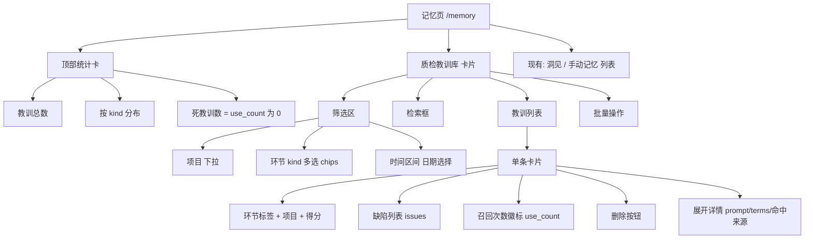

# 增量 PRD｜记忆闭环（记忆全量留存 + 教训沉淀回流 + 教训管理）

> 本文为**增量 PRD**，只描述本次变更，不重写全量 PRD。
> 产品名称：漫剧生成系统（AI 动态漫画短剧生成系统）
> 文档版本：v1.0 ｜ 阶段：需求 ｜ 作者：许清楚（PM）

---

## 0. 项目信息

| 项 | 内容 |
| --- | --- |
| Language | 中文 |
| Programming Language | 沿用现有技术栈：后端 Python / Flask（`app/app.py`），前端 Vite + React + TypeScript + MUI + Tailwind CSS（`frontend/`，产物构建入库 `app/static/`）。本次**不新增**技术栈。 |
| Project Name | `memory_loop`（记忆闭环） |
| 存储约束 | **一切记忆本地保存**，不引入数据库、不引入云服务。落盘格式沿用现有 JSON / 追加式 JSONL。 |

### 原始需求复述

用户要求：系统的「记忆」必须**全部本地留存**。具体反馈三点：

1. AI 总控的聊天记录要**全量留得住**，历史能回溯，不能因为条数上限被丢掉。
2. 质检教训要**覆盖全部质检环节**，不能只有资产图和分镜图在学，其它环节白学了。
3. 教训库要**能看能管**：能筛、能搜、能删，还能看出每条教训到底有没有被用上。

> 说明：现状勘察发现「AI 总控聊天记录已落盘」「质检教训已落盘并回流」这两件事其实**已实现**，缺的是「全量留存 / 全覆盖 / 可管理」。本 PRD 只写这三块增量。

---

## 1. 产品目标（一句话）

**把「对话记忆」与「质检教训」从「会丢、覆盖不全、看不见」升级为「全量可回溯、全环节闭环、可管理可度量」的本地记忆闭环。**

### 三个正交目标

| # | 目标 | 衡量标准（可度量） |
| --- | --- | --- |
| G1 | 对话历史不丢失 | 任一项目第 41 条及以后的对话，落盘率 100%，可按日期检索到；存档增长不影响单次模型调用长度。 |
| G2 | 质检教训全环节闭环 | 6 条质检路径（`asset` / `storyboard` / `video` / `keyframe` / `audio` / `script` / `prompt`）在「不达标」时均产生教训，且在对应提示词构造处可召回。 |
| G3 | 教训可管理可度量 | 用户可在界面按 项目/环节/时间 筛选、关键词检索、删除；每条教训可见被召回次数；「从未被召回」的教训可被识别。 |

---

## 2. 用户故事

### P0（必须有）

- **US-1（总控用户·全量留存）**：作为漫剧创作者，我想让总控对话**每条都留下来**，这样隔几天回来还能翻到当初谈定的设定变更过程，而不是发现早期对话不见了。
- **US-2（总控用户·按日期回溯）**：作为创作者，我想按日期翻某个项目的对话存档，这样我能复盘「哪天把画风从日式赛璐璐改成了国风水墨」。
- **US-3（成本约束·上下文有界）**：作为系统维护者，我要保证「存档可以无限长」但「送进模型的历史仍然有界」，这样不会因为历史越攒越多而把模型调用撑爆、成本失控。
- **US-4（质检闭环·尾帧）**：作为创作者，当某镜**尾帧**质检不达标时，我想让它也沉淀成教训并在下次尾帧出图前被召回，这样链式模式下坏尾帧不会顺着链污染后面所有镜。
- **US-5（质检闭环·配音）**：作为创作者，当**配音/音频**质检不达标（如情绪送不进 TTS、角色台词被旁白念）时，我要它沉淀教训并在下次配音文本构造时召回。
- **US-6（质检闭环·剧本）**：作为创作者，当**剧本**质检不达标时，我要它沉淀教训并在下次剧本生成时召回，避免同类结构/逻辑问题反复出现。
- **US-7（质检闭环·提示词预检）**：作为创作者，当**提示词预检**判定不可用时，我要它沉淀教训并在对应提示词构造处召回，从而在「生成前」就拦住废图输入。
- **US-8（教训管理·筛选）**：作为创作者，我想按 项目 / 环节(kind) / 时间 三个维度筛选教训，快速定位到「这个项目、这个环节最近犯过什么错」。
- **US-9（教训管理·检索）**：作为创作者，我想用关键词检索教训，定位「凡是提到发冠的教训」。
- **US-10（教训管理·删除）**：作为创作者，我想删除单条教训、或按 kind 清空，把误记/过时的教训清掉；删除要有二次确认，不能一点就没。
- **US-11（教训管理·召回计数）**：作为创作者，我想看到每条教训**被召回了几次**，这样我能识别出「记了但从来没被用上」的死教训，判断记忆是否真的在起作用。

### P1（应该有）

- **US-12（上下文摘要）**：作为创作者，我希望超出上下文窗口的更早对话能被压成摘要带进模型，这样总控不会「忘记」很早之前谈定的关键设定。
- **US-13（教训详情）**：作为创作者，我想点开一条教训看到完整信息（原始 prompt、缺陷列表、匹配关键词、得分、命中来源），这样我能判断它是否合理。
- **US-14（环节标签完整）**：作为创作者，我希望界面上看到的环节名称是「尾帧/配音/剧本/提示词预检」这些人话，而不是 `keyframe` / `audio` 这种原始值。

### P2（可以有）

- **US-15（存档导出）**：作为创作者，我想导出某项目的全部对话存档，便于离线归档。
- **US-16（教训导出）**：作为创作者，我想导出教训库，便于共享给他人。

---

## 3. 需求池明细

### 变更 1｜总控聊天记录「全量留存 + 按日期归档」

**现状缺陷（已核实）**：`app/ai_chat.py` 中 `HISTORY_MAX_MESSAGES = 40`，`save_history()` 对每个项目桶执行 `_clean_messages(...)[-HISTORY_MAX_MESSAGES:]`，**第 41 条之前的对话被直接丢弃，不可回溯**。

| ID | 优先级 | 需求 | 验收标准 |
| --- | --- | --- | --- |
| REQ-1.1 | P0 | **存档全量留存**：`save_history` 不再按 `HISTORY_MAX_MESSAGES` 裁剪丢弃消息；对话历史只增不减。 | 连续写入 100 条后，读回仍为 100 条；第 41 条及以后均可取到。 |
| REQ-1.2 | P0 | **按日期归档**：落 `output/ai_chat/archive/<项目键>/<YYYY-MM-DD>.jsonl`，追加式 JSONL（与 `output/lessons/lessons.jsonl` 同构，便于 grep 与追加）；项目键沿用 `ai_chat.canonical_project_key`。 | 同一项目跨 3 天产生对话，归档目录下出现 3 个日期文件；每行一条消息，含 `role` / `content` / `time` / 唯一 `msg_id`。 |
| REQ-1.3 | P0 | **存档与上下文解耦**（关键约束）：`CONTEXT_MESSAGES` 必须与存档独立，`build_messages` 送进模型的仍是**有界**的最近 N 条；存档无限增长**不改变**送模型的消息条数。 | 存档 1000 条时，`build_messages` 产出的对话消息数仍 ≤ `CONTEXT_MESSAGES`（含 system 外）。 |
| REQ-1.4 | P0 | **消息唯一标识**：每条落盘消息带稳定 `msg_id` 与 `time`，供归档去重、按日切分、单条删除（若后续需要）。 | 同一条消息在「热数据」与「归档」中的 `msg_id` 一致。 |
| REQ-1.5 | P1 | **上下文策略：最近 N 条 + 早期摘要**：超出 `CONTEXT_MESSAGES` 的更早对话，滚动压缩为摘要；摘要落 `output/ai_chat/archive/<项目键>/summary.json`，限长（如 ≤ 800 字）。 | 摘要存在时，`build_messages` 包含 1 条摘要消息 + 最近 N 条原文；摘要生成失败时**降级**为纯最近 N 条，不阻断对话。 |
| REQ-1.6 | P1 | **读路径内存有界**：存档不整体读进内存；`load_history` 只加载热数据窗口，归档按需懒加载。 | 归档达 10 万条时，`load_history` 耗时与内存占用不随归档总量线性增长。 |
| REQ-1.7 | P2 | **存档浏览/导出入口**：提供按项目+日期的对话存档查看与导出。 | 可导出为单个 JSON。 |

> **产品决策（上下文策略）**：本期采取「**最近 N 条原文 + 早期滚动摘要**」。其中 N 沿用现有 `CONTEXT_MESSAGES = 20`（可调），摘要作为 P1 增强。理由：全量留存解决的是「可回溯」，不是「全塞给模型」；把存档与上下文分开，才能同时满足「不丢」与「不炸」。

### 变更 2｜补齐 4 类质检教训的沉淀与回流

**现状缺陷（已核实，数据佐证）**：`_record_qc_lesson` 仅被调用在 `asset`（`app/app.py:2362, 2366`）、`storyboard`（`2937, 2962`）、`video`（`3378, 3606`）三条路径。实际 `output/lessons/lessons.jsonl` 共 **71 条**，`kind` 分布 **`asset`=3 / `storyboard`=68**——**`video` 有调用代码却一条未落盘**；`keyframe` / `audio` / `script` / `prompt` **完全没有沉淀调用**。

| ID | 优先级 | 需求 | 沉淀点（不达标时） | 召回点（构造提示词前） |
| --- | --- | --- | --- | --- |
| REQ-2.1 | P0 | **尾帧教训**：`kind="keyframe"` 沉淀 + 召回 | 尾帧质检回调 `_keyframe_qc_verifier`（`app/app.py:5174`）判定不达标处 | `app/keyframe.py` 尾帧提示词构造处（尾帧 prompt 组装函数） |
| REQ-2.2 | P0 | **配音教训**：`kind="audio"` 沉淀 + 召回 | 配音/音频质检不达标处（`prompt_qc.preflight("audio", ...)`，`app/app.py:7091` 一带） | 配音文本构造处（配音计划/台词构造点） |
| REQ-2.3 | P0 | **剧本教训**：`kind="script"` 沉淀 + 召回 | 剧本质检不达标处（`prompt_qc`/`qc_client.check_script`） | `app/script_generator.py` / `app/novel_to_script.py` 剧本文本构造处 |
| REQ-2.4 | P0 | **提示词预检教训**：`kind="prompt"` 沉淀 + 召回 | 提示词预检判定不通过处（`app/app.py:5254` `_qc_record(project_name, "prompt", ...)` 旁） | 各预检构造处（尾帧预检 `_keyframe_prompt_preflight` 等） |
| REQ-2.5 | P0 | **修复 `video` 空洞**：定位「有调用代码但 0 条落盘」的根因并修复，确保视频质检不达标真能落库。 | —— | `app/app.py:3511`（已有 `learned_prompt` 召回） |
| REQ-2.6 | P0 | **统一写入实例（数据完整性前置项）**：收敛教训库写入入口为**单一实例**，消除两个单例互相覆盖。 | —— | —— |
| REQ-2.7 | P1 | **kind 枚举化 + 前端标签补齐**：前端 `LESSON_KIND_LABEL` 补齐 `audio` / `script` / `prompt`（`keyframe` 已有）。 | —— | —— |

> **REQ-2.6 说明（已核实源码，非推断）**：`app/prompt_memory.py` 同时存在 `PromptMemory`（`get_memory`，`record()`）与 `PromptMemoryEnhanced`（`get_enhanced_memory`，`record_with_context()`）两个模块级单例，**两者 `_path` 都指向同一份 `output/lessons/lessons.jsonl`**，各自持有独立的内存列表并在 `_flush()` 时**整文件覆盖写**。后果是 last-writer-wins：A 实例写的教训会被 B 实例的下一次 flush 整体抹掉。而 `app/script_generator.py:181` 走的正是增强实例。**这是「全量留存」在教训侧的直接威胁，必须先于 REQ-2.1~2.4 解决**，否则新增的 4 类教训同样会丢。

### 变更 3｜教训管理界面

**现状**：`frontend/src/pages/MemoryPage.tsx` 已有「质检教训库」卡片，但只支持按 `kind` 切 tab、展示最近 20 条，**无筛选、无检索、无删除、无召回计数**。后端已有 `/api/memory/lessons`、`/api/memory/lessons/search`、`/api/memory/stats` 与 `prompt_memory.clear(kind)`。

| ID | 优先级 | 需求 | 说明 / 验收标准 |
| --- | --- | --- | --- |
| REQ-3.1 | P0 | **多维筛选浏览**：按 项目 / kind / 时间区间 筛选。 | 后端 `/api/memory/lessons` 需扩展 `project` / `since` / `until` / `offset` 参数（现仅 `kind` / `limit`）（推断，待架构师核实）。前端筛选器与列表联动。 |
| REQ-3.2 | P0 | **关键词检索（区分两件事）**： | ⚠️ 现 `/api/memory/lessons/search` 的语义是「**按提示词召回建议**」（入参 `prompt`，返回 `hints`/`learned_prompt`），**不是**「按关键词过滤已存教训」。本需求需要的是后者，应新增「关键词过滤」能力（如 `q=` 参数或新接口），不要复用错语义。（业务语义已核实） |
| REQ-3.3 | P0 | **删除单条 / 按 kind 清空**： | 按 kind 清空：后端 `prompt_memory.clear(kind)` **已存在**，仅需补接口暴露 + 二次确认。删除单条：**暂无 API**，需新增按标识删除（如 `DELETE /api/memory/lessons/<lesson_id>`）（推断，待架构师核实）。⚠️ 教训当前**无稳定主键**（结构为 `{"ts","project","kind","phash",...}`），需先定义 `lesson_id`（详见待确认问题 Q3）。**必须二次确认，不可撤销操作要显式警示。** |
| REQ-3.4 | P0 | **召回计数（新增落盘字段）**： | 每条教训新增 `use_count`（被召回次数）与 `last_used`（最近召回时间），召回命中时自增并回写。**产品价值**：区分「真在起作用的教训」与「记了从没被用的死教训」，让用户判断记忆闭环是否真的闭合，而不是只看条数。⚠️ 现状：`use_count`/`last_used` 仅出现在 `PromptMemoryEnhanced.record_with_context`（`app/prompt_memory.py:551-552`），且**从不自增**；基础 `record()` 产出的教训根本没有该字段，而实际召回路径 `suggestions()` 也不递增任何计数。（已核实源码） |
| REQ-3.5 | P1 | **教训详情展开**：展示完整 prompt、`issues`、`terms`、`score`、命中来源（同项目/跨项目/指纹命中）。 | 命中来源可由 `suggestions` 的打分项（`sim` / `kw_hit` / `proj_bonus`）派生。 |
| REQ-3.6 | P1 | **分页 / 加载更多**：教训超 60 条时可继续加载。 | 复用 `limit` + `offset`。 |
| REQ-3.7 | P1 | **教训「生效情况」展示** —— **本期不做（明确标注）**。 | 见下方 Non-Goals 与缺口说明。 |

#### 关于「生效情况」的缺口说明（诚实标注，不写成能做的样子）

用户期望看到「这条教训对应的提示词，在改进后是否**通过了质检**」。**本期无法实现**，原因是数据上不成立：

- 教训条目的结构为 `{"ts","project","kind","phash","prompt","issues","reason","score","terms"}`，**只记录「失败现场」，不记录失败之后的结局**；
- `prompt_memory.record()` 在写入时会**合并同 `phash`+`kind` 的旧记录，只保留最新一条**，因此「同一提示词先失败、后成功」的两次事件会丢掉前者，无法构成前后对比；
- 质检历史（`_qc_record` → `qc_client.append_history`）与教训是两个独立数据源，二者**没有关联键**（`phash` 未写入质检历史）。

**结论**：本期不做。若要做，前置工作是「为教训建立结局回链」：在教训上记录 `first_failed_ts` 与「后续同 `phash` 是否出现达标质检」，这需要新增字段与查询能力，建议作为下一迭代立项。

---

## 4. 关键约束与非目标（Non-Goals）

### 关键约束

1. **【最重要】「全量留存」≠「全量送模型」。** 存档（`archive/*.jsonl`，可无限增长）与上下文（`CONTEXT_MESSAGES`，必须有界）是**两个独立需求**，不得合并实现。存档增长不得使送进模型的历史变长——否则会因 token 爆炸导致模型调用失败或成本失控。产品决策：最近 N 条原文 + 早期滚动摘要（REQ-1.5），摘要失败必须优雅降级。
2. **教训库必须单一写入实例。** 在修复 `PromptMemory` / `PromptMemoryEnhanced` 双单例同文件覆盖（REQ-2.6）之前，任何新增沉淀都是不可靠的。
3. **纯本地存储。** 不引入数据库、不引入云服务、不上传任何记忆数据。
4. **存档不静默删除。** 「全量留存」是硬需求，磁盘治理（保留期/压缩）不得以静默删除用户可回溯的历史为代价；若需治理，必须显式、可配置、可告知。
5. **命名与现有代码符号保持一致**：`_record_qc_lesson`、`_qc_record`、`_qc_record_verdict`、`kind="keyframe"|"audio"|"script"|"prompt"|"video"|"asset"|"storyboard"`、`HISTORY_MAX_MESSAGES`、`CONTEXT_MESSAGES`、`save_history`、`prompt_memory.record`、`prompt_memory.clear`、`canonical_project_key`、`LESSON_KIND_LABEL`。

### Non-Goals（明确不做）

- ❌ 不重写全量 PRD，不重构无关模块。
- ❌ 不引入数据库 / 向量库 / 云服务（记忆必须本地）。
- ❌ 不做多用户、权限体系、协作。
- ❌ 不做教训的自动权重学习 / A-B 实验 / 模型自动调参。
- ❌ 不做教训「生效情况」看板（本期数据不支撑，见 §3 缺口说明）。
- ❌ 不做跨设备同步。

---

## 5. UI 设计描述

在现有 `MemoryPage.tsx` 的「质检教训库（自动学习）」卡片基础上增强，**不新增页面**。保持现有 MUI + Tailwind 视觉语言。

### 页面结构

### 关键交互

| 交互 | 行为 |
| --- | --- |
| 环节 chips | 由「单选 tab」升级为**多选**，含全部 7 类：资产参考图 / 分镜图 / 视频 / 尾帧 / 配音 / 剧本 / 提示词预检（映射 `LESSON_KIND_LABEL`，需补 3 项）。 |
| 项目筛选 | 下拉选择项目，默认「全部」。 |
| 时间筛选 | 日期区间（起/止），默认「不限」。 |
| 检索框 | 关键词输入，回车触发；命中 `issues` / `terms` / `prompt` 任一即命中。 |
| 召回次数 | 每条卡片显示 `被召回 N 次` 徽标；`N=0` 用灰色弱化样式并在统计卡单独计数「死教训」。 |
| 删除单条 | 点击 → `ConfirmDialog` 二次确认（danger），文案明确「此操作不可撤销」。 |
| 按 kind 清空 | 顶部「清空本环节」按钮 → 二次确认，需显示将删除的数量。 |
| 分页 | 列表底部「加载更多」。 |

### 文案约定

- 界面**不暴露原始 `kind` 值**（沿用现有 `LESSON_KIND_LABEL` 做法），未知 kind 回退显示原文。
- 「召回次数」需给 tooltip 解释：*「该教训被生成链路自动引用、用来改写提示词的次数。始终为 0 表示这条教训从未派上用场。」*

---

## 6. 待确认问题（Open Questions）

| # | 问题 | 影响 | 建议归属 |
| --- | --- | --- | --- |
| Q1 | 存档的**唯一真相源**：是「`chat_history.json` 全量 + 归档 jsonl 仅作冷备」，还是「归档 jsonl 为唯一真相源 + 热数据窗口 + 索引」？现有 `chat_history.json` 是读改写整文件（`save_history`），全量留存后文件会持续膨胀。 | 决定 REQ-1.1/1.2/1.6 的实现形态与迁移方案 | 架构师 |
| Q2 | 现有 71 条教训数据的**迁移与兼容**：统一单例后，`PromptMemoryEnhanced` 产生的字段（`category`/`priority`/`context`/`decay_weight`）是否保留？`use_count` 对存量数据如何回填（默认 0 还是按 `ts` 估算）？ | 决定 REQ-2.6 / REQ-3.4 | 架构师 |
| Q3 | 教训的**稳定主键**：当前结构无唯一 ID。删除单条（REQ-3.3）与召回计数回写（REQ-3.4）都需要稳定标识。用 `phash + kind`？还是新增 `lesson_id`？ | 决定 REQ-3.3 / REQ-3.4 | 架构师 |
| Q4 | **上下文策略参数**：`CONTEXT_MESSAGES` 是否维持 20？是否引入摘要？摘要由谁生成（额外一次模型调用的成本与失败降级）？摘要的合并/更新频率？ | 决定 REQ-1.5 | 架构师 + PM 复核 |
| Q5 | **`video` 零落盘根因**：是上游 `rec` 为空、质检未开启、还是调用路径未真正走到？需先定位再谈补齐。 | 决定 REQ-2.5 | 架构师 |
| Q6 | **`audio` / `prompt` 预检的召回点定位**：这两类目前只有「预检记录」（`prompt_qc.preflight`），需确认其提示词构造点在哪、能否稳定注入召回（`learned_prompt` 式的追加改写）。 | 决定 REQ-2.2 / REQ-2.4 的可落地性 | 架构师 |
| Q7 | 「按 kind 清空」的**权限**：本系统无用户体系，是否需要额外的操作确认门槛（如输入 kind 名确认）？ | 决定 REQ-3.3 交互 | PM |

---

## 7. 附：需求优先级汇总

| 优先级 | 需求 ID | 条数 |
| --- | --- | --- |
| **P0** | REQ-1.1 ~ 1.4、REQ-2.1 ~ 2.6、REQ-3.1 ~ 3.4 | **14** |
| P1 | REQ-1.5、1.6、REQ-2.7、REQ-3.5 ~ 3.7 | 6 |
| P2 | REQ-1.7 | 1 |

**P0 需求共 14 条。**

---

*本文档所有既有代码符号与数据事实均来自源码核对（`app/app.py`、`app/ai_chat.py`、`app/prompt_memory.py`、`app/script_generator.py`、`frontend/src/pages/MemoryPage.tsx`、`output/lessons/lessons.jsonl`）。凡属推断而非核实之处，均已标注「（推断，待架构师核实）」。*
